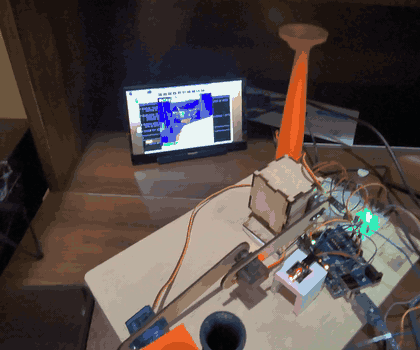
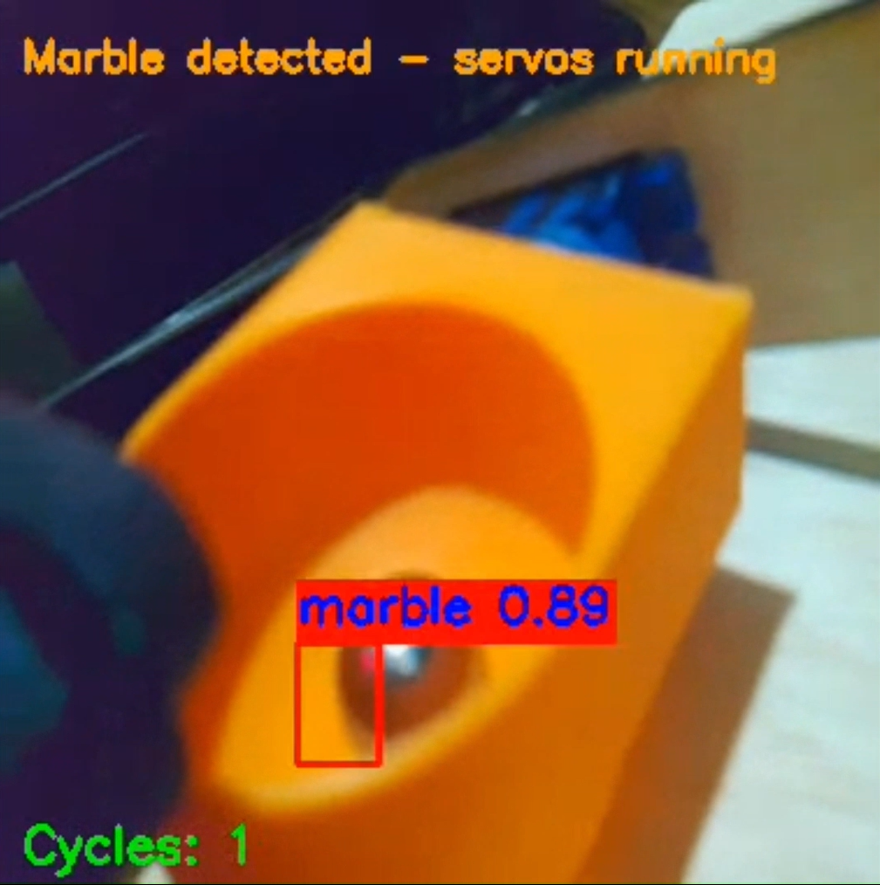
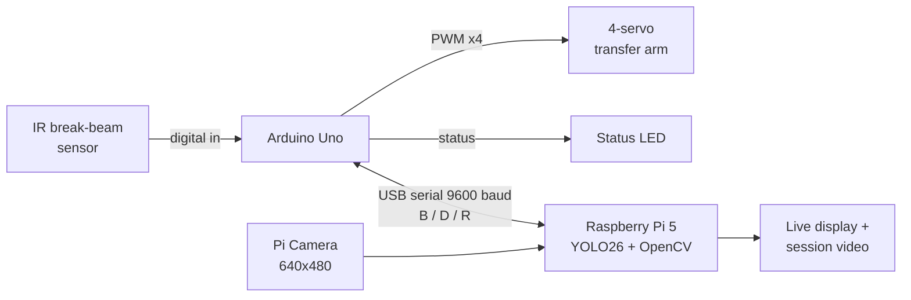
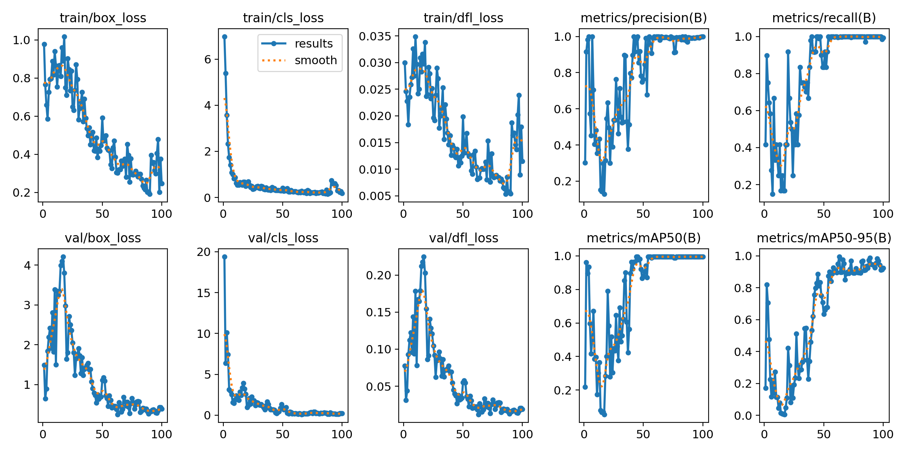

# Automated Marble Detection & Transfer System

An autonomous, vision-guided pick-and-transfer system. An IR break-beam sensor detects a marble entering a chute. A **Raspberry Pi 5** confirms it with a **custom-trained YOLO26 model**, and an **Arduino** drives a four-servo arm that moves the marble from the entrance chute to the exit chute. The cycle repeats with no operator input.

*Independent senior design project, B.S. Electrical & Computer Engineering Technology, NJIT (Spring 2026). Author: Erick Palomeque.*

<p align="center">
  
  &nbsp;
  
</p>
<p align="center"><em>Left: full transfer cycle — marble detected, servo arm lifts it to the exit chute and returns home (real speed). Right: Pi camera view with live YOLO26 detection.</em></p>

---

## Highlights

- **Custom object detection:** trained a single-class YOLO26 model (Ultralytics, 100 epochs, augmented dataset) on the specific metal marble. Precision, recall, and mAP50 converge near 1.0 and mAP50-95 reaches ~0.92.
- **Two-board architecture:** the Pi handles vision and supervision. The Arduino handles real-time I/O (beam sensing, LED status, servo motion) over a simple USB-serial command protocol.
- **Event-driven inference:** YOLO only runs after the IR beam trips, so the Pi is idle between marbles.
- **Four-servo arm:** designed, built, and tuned by hand. Servo motion was simulated in Tinkercad before hardware assembly, and speed is profiled separately for forward and return strokes.
- **Operator feedback:** a live OpenCV overlay shows state, bounding box, confidence, and a cycle counter. Each session is recorded to video.

---

## System Architecture



### Control flow / state machine

| State | Entered when | What happens | LED |
|---|---|---|---|
| `WAITING` | Startup, or Arduino sends `R` | Camera preview, system armed | Solid |
| `DETECTING` | Arduino sends `B` (beam tripped) | YOLO26 runs on each frame | Solid |
| `RUNNING` | Marble detected, Pi sends `D` | Servo transfer sequence runs, cycle count +1 | Flashing |

### Serial protocol

| Char | Direction | Meaning |
|---|---|---|
| `B` | Arduino → Pi | Beam broken (debounced 10 ms), marble in entrance chute |
| `D` | Pi → Arduino | Marble confirmed, run transfer sequence |
| `R` | Arduino → Pi | Sequence complete, arm home, ready for next marble |

### Pi software (three threads)

- **Main thread:** captures frames with Picamera2, draws the overlay, writes video, and shows the window.
- **Inference thread:** runs YOLO26 only in `DETECTING`. It drops stale frames so the display never stalls.
- **Serial thread:** listens for `B` / `R` and drives state transitions.

---

## Hardware

| Component | Role |
|---|---|
| Raspberry Pi 5 + Pi Camera | Vision processing and system supervisor |
| Arduino Uno | Sensor input, LED, and servo control |
| IR break-beam sensor | Detects marble entry (TX pin 11, RX pin 12) |
| 4 × hobby servos | Transfer arm (PWM pins 3, 5, 6, 9) |
| LED | Status indicator (pin 10) |
| USB cable | Arduino power and serial link |

---

## Training Results

<p align="center">
  
</p>

Losses converge smoothly over 100 epochs. The early validation-loss spike came from a small initial dataset. Augmenting it with rotations, brightness changes, and varied backgrounds stabilized training. This model replaced an earlier OpenCV color/contour approach that failed on the marble's reflective surface under changing light.

---

## Repository Layout

```
├── raspberry_pi/marble_transfer.py            # Main Pi application
├── arduino/servo_controller/servo_controller.ino  # Arduino sketch
├── model/metal_sphere_detector.pt             # Trained YOLO26 weights
├── media/                                     # Screenshot and training curves
└── requirements.txt
```

## Running It

1. Upload `arduino/servo_controller/servo_controller.ino` to the Arduino with the Arduino IDE.
2. Connect the Arduino to the Pi over USB. The default port is `/dev/ttyACM0`; change `SERIAL_PORT` if yours differs.
3. On the Pi:
   ```bash
   pip install -r requirements.txt
   python3 raspberry_pi/marble_transfer.py
   ```
4. Press **`q`** to quit. The session video is saved as `final_video.avi`.

---

## Limitations & Next Steps

- **Known limitations:** partial occlusion at steep entry angles, glare under strong direct light, single-class model, and 9600-baud serial latency.
- **Next steps:** Coral Edge TPU for faster inference (so the IR trigger isn't needed), an exit-chute sensor for closed-loop verification, 115200 baud, and a web dashboard for remote monitoring.
